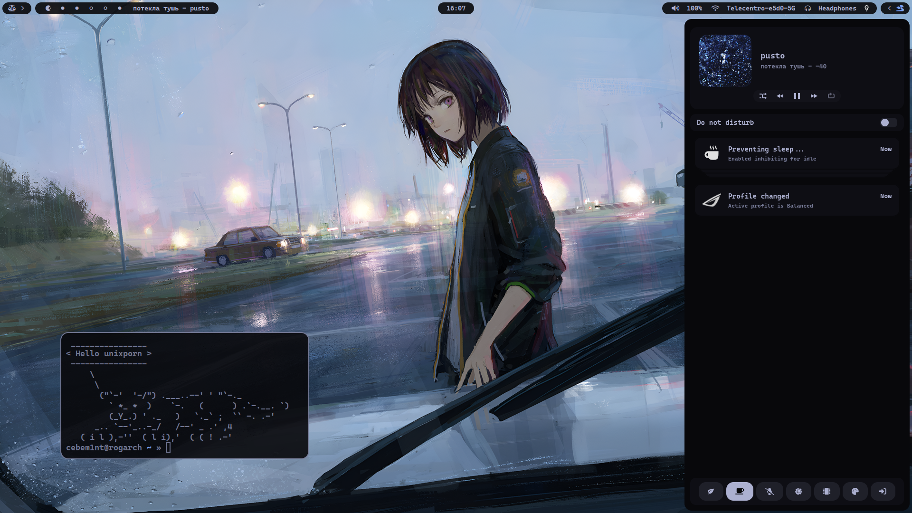
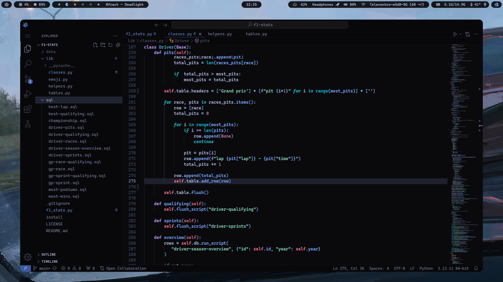
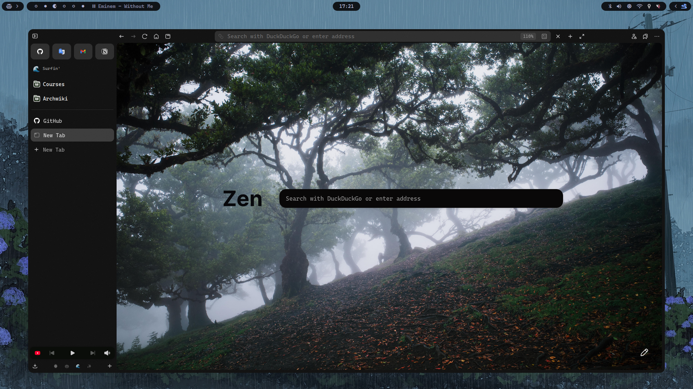
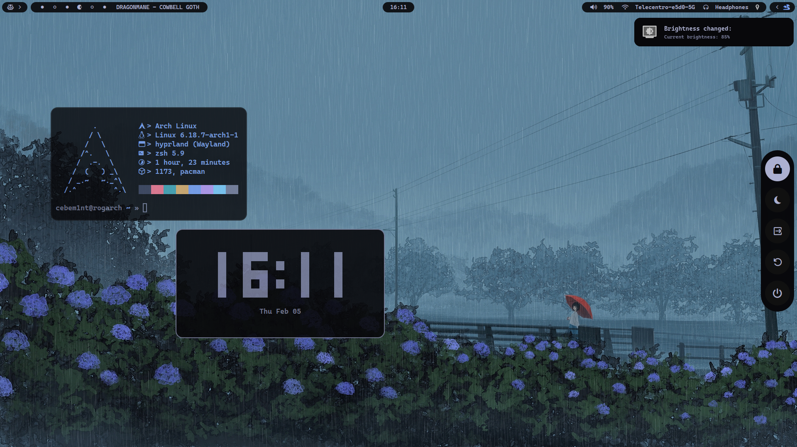
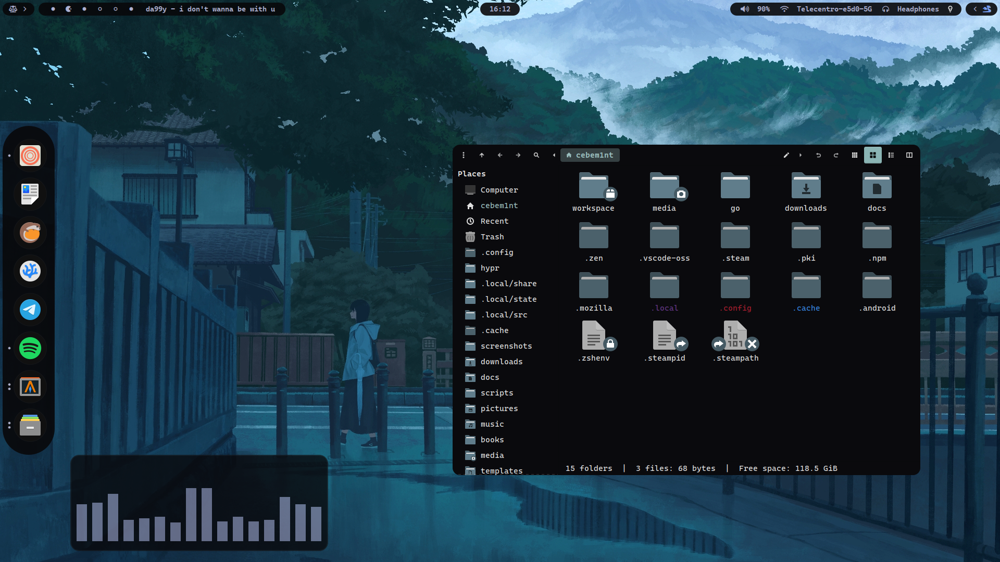
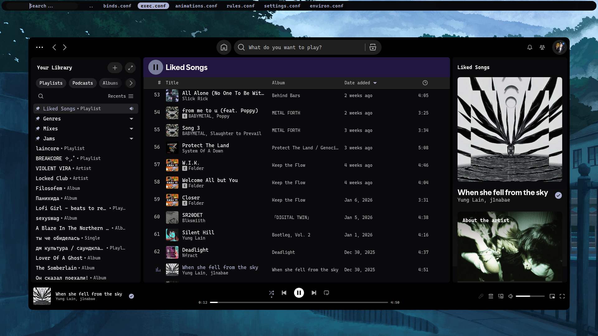

# My dotfiles
My archlinux dotfiles, some scripts and wallpapers 

## Info

- Panel: waybar
- All the menus (except notifications): rofi
- Notifications: swaync
- Terminal: alacritty
- Shell: zsh
- Font: Cascadia Code
- GTK theme: [kripton](https://github.com/EliverLara/Kripton)
- Icon theme: [Papirus](https://github.com/PapirusDevelopmentTeam/papirus-icon-theme)
- fetch: [mine :)](https://github.com/cebem1nt/sillyfetch)

Big thanks to this [collection of rofi themes](https://github.com/adi1090x/rofi)

## Previews

<table>
  <tr>
    <td></td>
    <td></td>
  </tr>
  <tr>
    <td></td>
    <td></td>
  </tr>
  <tr>
    <td></td>
    <td></td>
  </tr>
</table>

<details>
  <summary><h2>Waybar</h2></summary>
  
  

</details>
<details>
  <summary><h2>Rofi</h2></summary>

### filebrowser


<table>
  <tr>
    <td><h3>bookmarks</h3></td>
    <td><h3>wallpaper picker</h3></td>
    <td><h3>nf icons picker / clipboard</h3></td>
  </tr>
  
</table>

</details>

## Structure
```
~/.config/hypr # Hyprland configuration
├── configs
│   ├── animations.conf 
│   ├── binds.conf
│   ├── environ.conf # Environment variables
│   ├── exec.conf # Startup scripts
│   ├── rules.conf # Window/layer rules
│   └── settings.conf # Misc settings
├── hypridle.conf
├── hyprland.conf # Monitor configuration is here
├── hyprlock.conf
└── scripts
    ├── resize_gaps
    └── switch_layout

~/.config/waybar # Waybar configuration files
├── config.jsonc
├── context # Context menus
│   ├── ctlcenter.xml
│   └── network.xml
├── css
│   ├── colors.css
│   └── style.css # Main css
├── layouts
│   ├── with_music.jsonc   # Layout with mpris at left
│   └── with_window.jsonc  # Layout with current window title  
├── modules.jsonc # Modules configuration
└── style.css
```

### Misc
You can find some usefull scripts in `~/.local/bin` they are added to path by default in `~/.config/zsh/.zshrc`. If you have a keyboard with backlight, you can setup auto_walls to automatically set best matching color, see `.config/auto_walls/config.json`  

## Installation

> [!WARNING]  
> My dotfiles are __*laptop specific*__. Despite trying to make a flexible installation script, some of the things might not work! You better install everything manually based on your needs, or use this repository as an inspiration.

The installation script assumes you have a minimal working system! Firstly lets install all the necessary packages. On arch based distros you can copy & paste this command:

```sh
sudo pacman -S hyprland hyprlock hypridle waybar swaync alacritty cava rofi pavucontrol thunar zsh ttf-cascadia-code ttf-cascadia-code-nerd swww python-psutil eza fzf htop jq neovim xdg-desktop-portal-gtk xdg-desktop-portal-hyprland grim slurp nvtop nwg-look mission-center powertop qt6ct kvantum noto-fonts noto-fonts-emoji flameshot wtype papirus-icon-theme
```

And run this with your AUR helper (example with yay):

```sh
yay -S spicetify-cli vscodium-bin zen-browser-bin peaclock bibata-cursor-theme kripton-theme-git
```

### Bluegrey folders
For this, install `papirus-folders` cli tool, or download and install icon pack with bluegrey folders [directly](https://www.gnome-look.org/p/1166289)

```sh
yay -S papirus-folders-git
```

```sh
# Apply the color theme
papirus-folders -C bluegrey
```

After successful installation, you can safely uninstall the script

```sh
yay -Rns papirus-folders-git
```

Now clone the repo & run the installer:

```sh
git clone https://github.com/cebem1nt/dotfiles.git --depth=1
cd dotfiles
./install # Do not run as super user!
```

## Uninstallation
Just run `restore` script, it will restore all your previous config files stored at `~/.local/old`. If your files were not restored, take look at `~/.local/` there might be multiple `old` directories if you were running installer more than once

```sh
./restore
```

## Binds

| Bind                  | Description              |
|---------------------- |--------------------------|
| `SUPER + ;`           | Open terminal            |
| `SUPER + n`           | Open browser             |
| `SUPER + m`           | Open vscodium            |
| `SUPER + b`           | Open thunar              |
| `SUPER + q`           | close window             |
| `SUPER SHIFT + q`     | kill window              |
| `SUPER + w`           | center window            |
| `SUPER + f`           | toggle floating window   |
| `SUPER SHIFT + f`     | fullscreen window        |
| `SUPER + u`           | pin window               |
| `SUPER + o`           | toggle windows grouping  |
| `SUPER + arrow keys`  | move focus in direction  |
| `SUPER + 1...6`       | go to workspace          |
| `SUPER SHIFT + 1...6` | move to workspace        |
| `SUPER CTRL + 1...6`  | move & go to workspace   |
| `SUPER + s`           | toggle special workspace |
| `SUPER SHIFT + s`     | move to special workspace|
| `SUPER + r`           | Drun (app runner)        |
| `SUPER + t`           | Notification center      |
| `SUPER + v`           | Clipboard                |
| `SUPER + y`           | Wallpapers               |
| `SUPER + ESCAPE`      | Logout menu              |
| `SUPER + e`           | Filebrowser menu         |
| `SUPER SHIFT + v`     | Glyphs selector          |
| `SUPER SHIFT + r`     | Shell commands runner    |
| `SUPER SHIFT + e`     | Bookmarks                |
| `SUPER CTRL  + r`     | Reload hyprland config   |
| `SUPER SHIFT + >`     | Cycle next wallpaper     |
| `SUPER SHIFT + <`     | Cycle prev wallpaper     |
| `SUPER SHIFT + /`     | Toggle auto wallpapes cycle|

> [!NOTE]
> For more detailed info see `.config/hypr/configs/binds.conf`. It's well commented, you can find more fancy keybinds like: next/prev song, hide waybar, record video, increase/decrease volume or change them

## Something doesn't work/missing ? 
Feel free to post an issue or contribute!
